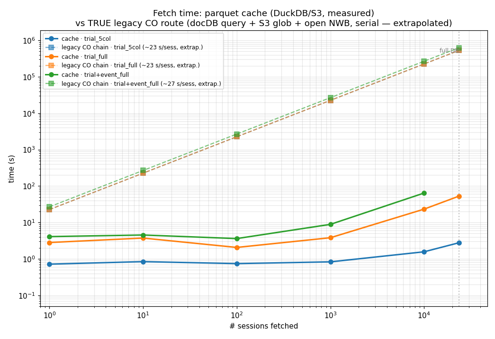

# `foraging_cache` — querying the dynamic-foraging parquet database

A Hive-partitioned **parquet database** of AIND dynamic-foraging behavior (one row per
session / trial / event), assembled from NWB files across three sources. Pull behavior for
arbitrary mice / sessions — or the whole dataset — in **seconds** with a few Python calls (the
**query helpers**, DuckDB + pandas under the hood), instead of opening thousands of NWBs.

> 🚀 **Start with the query helpers** — importable from `aind_dynamic_foraging_data_utils.foraging_cache`,
> they wrap DuckDB and hand back a pandas DataFrame:
> - **`select_sessions(where=…, subjects=…, columns=…)`** — filter the (small) session table on any
>   metric / metadata (or a subject list); returns a DataFrame of the selected sessions.
> - **`fetch_trials(sel, …)` / `fetch_events(sel, …)`** — pull those sessions' trials / events with the
>   session metadata joined onto every row, reading only the selected subjects' partitions (fast).
> - **`read_trials(subjects)` / `read_events(subjects)`** — escape hatch: a fast, partition-scoped
>   `read_parquet(...)` clause to drop into any DuckDB SQL you write (aggregations, windows, joins).
>
> See [**Quick start**](#quick-start--the-query-helpers) for runnable examples; drop to native SQL
> only when the helpers don't cover what you need.

> 💡 **Need custom DuckDB SQL? Let an LLM write it.** This README is self-contained: paste the
> whole file into the LLM of your choice (Claude / ChatGPT / Cursor / …) as context, then ask
> in plain English (e.g. *"trials for subjects 754372 and 758435 with foraging_eff > 0.8"*).
> It will return runnable DuckDB that follows the conventions below — including the key
> columns. See [**Use an LLM**](#use-an-llm-to-write-queries) for a copy-paste preamble — or, with
> a coding agent (Claude Code / Codex / OpenCode), load the `aind-dynamic-foraging-data-access`
> skill in `.claude/skills/` instead.

> 📊 **Prefer to browse the session metadata visually?** The interactive
> [**foraging behavior browser**](https://foraging-behavior-browser.allenneuraldynamics.org/)
> (Streamlit) renders this same session table with rich plots and point-and-click filters —
> a great way to find sessions/subjects before pulling their trials/events here.
> *Caveat:* the app is built from **Han's pipeline** only, so the **~381 CO-only sessions** this
> cache adds from the Code Ocean universe (all `nwb_data_source = 'co_asset'`, with NULL Han
> metadata — find them via `WHERE foraging_eff IS NULL`) **do not appear in the app**, even though
> their trials/events are fully in the cache.

> 🔧 **Building or extending the database?** See **[`README_build.md`](README_build.md)**.

---

## The database

Three tables on a **public** S3 bucket (`s3://aind-scratch-data/aind-dynamic-foraging-cache/`):

| Table | Path | Grain | Size |
|---|---|---|---|
| **session** | `session_table.parquet` | one row per session | ~24k rows × 160 cols (~MB) |
| **trial** | `trial_table/subject_id=<id>/…parquet` | one row per trial | ~12.5M rows × 103 cols (~21 GB) |
| **event** | `event_table/subject_id=<id>/…parquet` | one row per behavioral event | ~13.4M rows × 10 cols |

The trial/event tables are **Hive-partitioned by `subject_id`** and coalesced to one file per
subject. The bucket is **public — DuckDB reads `s3://` natively with no AWS credentials or
setup** (httpfs auto-loads). Point at a local directory instead to query a local build.

The paths are importable:

```python
from aind_dynamic_foraging_data_utils.foraging_cache import SESSION_DB, TRIAL_DB, EVENT_DB
```

---

## Quick start — the query helpers

Reach for the helpers first. They do the fiddly, easy-to-get-wrong part (reading the right
partition files, fast *and* correct) and hand back a pandas DataFrame. Drop to
[native SQL](#native-sql-what-the-helpers-are-built-on) only when you need more.

```python
from aind_dynamic_foraging_data_utils.foraging_cache import (
    select_sessions, fetch_trials, fetch_events,
)

# 1) Filter the (small) session table on any metric / metadata.
sel = select_sessions("task LIKE '%Uncoupled%' AND finished_trials > 500 AND finished_rate > 0.9")

# 2) Pull those sessions' trials — session metadata is joined onto every row.
trials = fetch_trials(sel, columns=["animal_response", "earned_reward",
                                    "reward_probabilityL", "reward_probabilityR"])

# ... or their events (optionally restricted to certain event types).
licks = fetch_events(sel, events=["left_lick_time", "right_lick_time"])
```

**Two workflows, same two calls** — the only difference is how you filter the session table:

- **Filter on session metrics/metadata, then fetch** — pass a `where=` predicate (any column
  of the session table; see [filter columns](#common-filter-columns-session-table)).
- **Subject first, then session, then fetch** — pass `subjects=[...]` (optionally with `where=`):

```python
sel = select_sessions("finished_trials > 200", subjects=["754372", "758435"])
trials = fetch_trials(sel, columns=["animal_response", "earned_reward"])
```

`fetch_trials` / `fetch_events` read **only the selected subjects' partition files** (≈1 s, not
every subject's) and inner-join to your selection, so you get exactly those sessions' rows with
their metadata attached — one row per trial/event, leading `subject_id, session_date,
session_id`. Add `columns=` to project specific columns (default is a small choice/reward set;
`columns="*"` returns all — large).

### Need more than the helpers cover? Drop to SQL on a fast source

The helpers don't try to express *every* query (aggregations, window functions, trial↔event
joins). For those, `read_trials(subjects)` / `read_events(subjects)` return a **fast,
partition-scoped `read_parquet(...)` clause** you drop into any SQL — so you keep the full
power of SQL without the slow full-table glob:

```python
import duckdb
from aind_dynamic_foraging_data_utils.foraging_cache import read_trials

src = read_trials(["754372", "758435"])           # scoped -> reads only these subjects' files
duckdb.sql(f"""
    SELECT subject_id, COUNT(*) AS n_trials, AVG(earned_reward::DOUBLE) AS reward_rate
    FROM {src} GROUP BY subject_id ORDER BY subject_id
""").df()
```

`read_trials()` / `read_events()` with no arguments return the full-table glob (correct for any
query, but reads every subject's footer — slow; scope to subjects whenever you can).

> All helpers query the public S3 cache by default. Pass `base=` (a local dir or another S3
> prefix) to any of them to query a different build.

---

## Native SQL (what the helpers are built on)

Everything below is the raw DuckDB layer. Use it directly when you want full control — or to
understand what the helpers do under the hood. (You can still read the session table directly,
e.g. `duckdb.sql(f"SELECT COUNT(*) FROM read_parquet('{SESSION_DB}') WHERE subject_id = '754372'")`.)

## The three read options (always use these on the partitioned tables)

```python
READ_TRIALS = f"read_parquet('{TRIAL_DB}/**/*.parquet', hive_partitioning=true, union_by_name=true)"
READ_EVENTS = f"read_parquet('{EVENT_DB}/**/*.parquet', hive_partitioning=true, union_by_name=true)"
```

- **`hive_partitioning=true`** — exposes `subject_id` from the directory name and prunes
  partitions, so filtering by `subject_id` reads only that mouse's file(s).
- **`union_by_name=true`** — merges columns across the three NWB readers (a column missing in
  some files fills with `NULL` instead of erroring).
- **`CAST(subject_id AS VARCHAR)`** — in the trial/event tables `subject_id` comes from the
  partition directory and DuckDB infers it as **BIGINT**; the session table stores it as a
  **string**. Always cast when filtering/joining `subject_id` on the trial/event tables.

The session table is a single plain parquet — read it with `read_parquet('{SESSION_DB}')`
(no options needed).

---

## Keys & joins

- Session key column is **`_session_id`** in the session table; the trial/event tables call it
  **`session_id`** (same value: `"{subject_id}_{session_date}_{nwb_suffix}"`).
- Canonical pattern — **filter sessions, then JOIN to trials** so every trial row carries its
  session metadata:

```python
df = duckdb.sql(f"""
    WITH sel AS (
        SELECT _session_id, subject_id, session_date, task, foraging_eff
        FROM read_parquet('{SESSION_DB}')
        WHERE task LIKE '%Uncoupled%' AND foraging_eff > 0.8
    )
    SELECT s.subject_id, s.session_date, t.session_id,
           t.animal_response, t.earned_reward,
           t.reward_probabilityL, t.reward_probabilityR
    FROM {READ_TRIALS} t
    JOIN sel s ON t.session_id = s._session_id
    WHERE CAST(t.subject_id AS VARCHAR) IN (SELECT subject_id FROM sel)
    ORDER BY s.subject_id, s.session_date
""").df()
```

(The extra `WHERE CAST(subject_id …) IN (…)` lets DuckDB prune partitions before the join.)

---

## Common filter columns (session table)

Almost all analyses start by selecting sessions on a few columns of the **session table**, then
joining to trials/events. The columns you'll filter on most:

| Filter on | Column(s) | Example values / predicate |
|---|---|---|
| **Identity** | `subject_id`, `session_date` | `subject_id IN ('754372','758435')`; `session_date >= '2024-01-01'` |
| **Institute / hardware / rig** | `institute`, `hardware`, `rig_type`, `room` | `institute`: `AIND` \| `Janelia`; `hardware`: `bonsai` \| `bpod`; `rig_type`: `training` \| `ephys`; `room`: `447`, `446`, … → e.g. `institute = 'Janelia'`, `hardware = 'bpod'`, `rig_type = 'ephys'` |
| **Behavior task** | `task` | `Uncoupled Baiting`, `Coupled Baiting`, `Uncoupled Without Baiting`, `Coupled Without Baiting` → `task LIKE '%Uncoupled%'` |
| **Curriculum** | `curriculum_name`, `curriculum_version` | e.g. `Uncoupled Baiting` / `'2.3'`; **`'None'` = off-curriculum** → `curriculum_name <> 'None'` for on-curriculum only |
| **Curriculum stage** | `current_stage_actual` | `STAGE_1_WARMUP` → `STAGE_1` → `STAGE_2/3/4` → `STAGE_FINAL` → `GRADUATED` (`'None'` = off-curriculum). For fully-trained sessions use the **"Final stages"**: `current_stage_actual IN ('STAGE_FINAL', 'GRADUATED')` (see note below) |
| **Performance metrics** | `finished_trials`, `finished_rate`, `foraging_eff`, `total_trials`, `reward_trials`, `bias_naive`, … | combine freely: `foraging_eff > 0.8 AND finished_trials > 200 AND finished_rate > 0.7` |

> 💡 **Use `institute` / `hardware` / `rig_type` for high-level grouping** (clean values:
> `AIND`/`Janelia`, `bonsai`/`bpod`, `training`/`ephys`). `data_source` is their fine-grained
> concatenation (e.g. `AIND_training_447_bonsai`) — usually too granular to filter on directly.
> And **`data_source` ≠ `nwb_data_source`**: `nwb_data_source` (`co_asset`/`bonsai_s3`/`bpod_s3`)
> is just *which NWB the cache built the row from*, not a science filter.
>
> **Curriculum "off" vs "missing":** off-curriculum sessions have the **string** `curriculum_name
> = 'None'` (and `curriculum_version = 'None'`); the ~381 CO-only sessions absent from Han have
> SQL `NULL`. `curriculum_name NOT IN ('None')` keeps on-curriculum sessions (it also drops the
> NULLs).
>
> **"Final stages" — `STAGE_FINAL` vs `GRADUATED`:** a curriculum's terminal *training
> parameters* are reached at `current_stage_actual = 'STAGE_FINAL'`; once a mouse meets the
> graduation criteria the stage is relabeled `'GRADUATED'` — but **both run the identical task
> parameters**. So for "fully-trained" sessions, treat them as one:
> `current_stage_actual IN ('STAGE_FINAL', 'GRADUATED')`.
>
> **Curriculum vs. `task` — related but not the same.** `curriculum_name` is the auto-training
> *program* a mouse is enrolled in (named after its **target task**, and constant as the mouse
> progresses); `task` is the paradigm **actually run that session**, which changes by stage
> because the curriculum ramps difficulty. E.g. the *Uncoupled Baiting* curriculum runs the
> easier **Coupled Baiting** task in `STAGE_1_WARMUP`→`STAGE_2`, then switches to **Uncoupled
> Baiting** from `STAGE_3`→`STAGE_FINAL`/`GRADUATED`. So filter **`curriculum_name`** to pick mice
> *enrolled in* a program, and **`task`** to pick sessions that *actually ran* a paradigm — they
> match for most sessions but differ for ~3.2k on-curriculum sessions (the early stages).

---

## Schema catalog

Column types come straight from the files. To list **every** column of a table:

```python
duckdb.sql(f"DESCRIBE SELECT * FROM read_parquet('{SESSION_DB}')").df()          # 160 cols
duckdb.sql(f"DESCRIBE SELECT * FROM {READ_TRIALS}").df()                          # 103 cols
duckdb.sql(f"DESCRIBE SELECT * FROM {READ_EVENTS}").df()                          # 10 cols
```

### session table (key columns; 160 total)
| column | type | meaning |
|---|---|---|
| `_session_id` | VARCHAR | session key → join to trial/event `session_id` |
| `subject_id` | VARCHAR | mouse ID (string) |
| `session_date` | VARCHAR | `YYYY-MM-DD` |
| `nwb_suffix` | BIGINT | session start `HHMMSS` as int (disambiguates same-day sessions) |
| `task` | VARCHAR | e.g. `Uncoupled Baiting`, `Coupled Baiting`, `Uncoupled Without Baiting` |
| `total_trials` | DOUBLE | foraging trials, **autowater excluded** |
| `total_trials_with_autowater` | DOUBLE | all trials (= trial-table `COUNT(*)`) |
| `finished_trials` | DOUBLE | non-ignored foraging trials |
| `ignored_trials` | DOUBLE | foraging trials with no response |
| `finished_rate`, `ignore_rate` | DOUBLE | finished / ignored fraction |
| `reward_trials` | DOUBLE | earned (non-autowater) rewards |
| `reward_rate` | DOUBLE | reward / finished |
| `foraging_eff` | DOUBLE | foraging efficiency vs ideal |
| `foraging_performance` | DOUBLE | `foraging_eff × finished_rate` |
| `bias_naive` | DOUBLE | side bias, −1 (left) … +1 (right) |
| `autowater_collected`, `autowater_ignored` | DOUBLE | autowater trial counts |
| `reaction_time_median`, `early_lick_rate` | DOUBLE | timing / lick metrics |
| `institute`, `hardware`, `rig_type` | VARCHAR | **high-level grouping** — `AIND`/`Janelia`, `bonsai`/`bpod`, `training`/`ephys` |
| `room` | VARCHAR | rig room (`447`, `446`, `347`, …) |
| `data_source` | VARCHAR | fine-grained composite ≈ `{institute}_{rig_type}_{room}_{hardware}` (e.g. `AIND_training_447_bonsai`) — **≠ `nwb_data_source`** |
| `curriculum_name`, `curriculum_version` | VARCHAR | curriculum + version; **`'None'` = off-curriculum**, `NULL` = not in Han |
| `current_stage_actual` | VARCHAR | curriculum stage reached: `STAGE_1_WARMUP`…`STAGE_FINAL`/`GRADUATED` — the two **"Final stages"** (`STAGE_FINAL`, `GRADUATED`) share training parameters; `'None'` = off-curriculum |
| `rig`, `trainer`, `PI` | VARCHAR | session metadata |
| `weight_after`, `water_in_session_total` | DOUBLE | weight / water |
| `logistic_*`, `abs(*_bias)` | DOUBLE | fitted logistic-regression model coefficients |
| `nwb_data_source` | VARCHAR | `co_asset` \| `bonsai_s3` \| `bpod_s3` — which NWB the cache built the row from (not a science filter) |
| `co_asset_id`, `co_s3_nwb_uri` | VARCHAR | Code Ocean asset id / NWB URI (NULL if none) |

### trial table (key columns; 103 total)
| column | type | meaning |
|---|---|---|
| `session_id` | VARCHAR | join key → session `_session_id` |
| `subject_id` | BIGINT* | mouse ID — *cast to VARCHAR when filtering* (partition column) |
| `session_date` | VARCHAR | `YYYY-MM-DD` |
| `nwb_suffix` | BIGINT | session suffix |
| `trial` | DOUBLE | trial index within the session |
| `animal_response` | DOUBLE | **0 = lick left, 1 = lick right, 2 = ignore (no response)** |
| `earned_reward` | BOOLEAN | earned a (non-autowater) reward (= `rewarded_historyL OR rewarded_historyR`) |
| `rewarded_historyL` / `rewarded_historyR` | BOOLEAN | reward delivered on left / right |
| `reward_probabilityL` / `reward_probabilityR` | DOUBLE | scheduled reward prob per side |
| `auto_waterL` / `auto_waterR` | BIGINT | autowater given on left / right (**non-autowater trial = both 0**) |
| `reward_random_number_left` / `_right` | DOUBLE | the draw used for baiting |
| `goCue_start_time_in_session` | DOUBLE | go-cue time (s from session start) |
| `choice_time_in_session` | DOUBLE | choice (lick) time (s) |
| `reward_time_in_session` | DOUBLE | reward time (s) |
| `reaction_time` | DOUBLE | choice − go-cue (s) |
| `laser_*` | mixed | optogenetics parameters (NULL on non-opto trials) |
| `nwb_data_source` | VARCHAR | reader source |

### event table (all 10 columns)
| column | type | meaning |
|---|---|---|
| `session_id` | VARCHAR | join key → session `_session_id` |
| `subject_id` | BIGINT* | mouse ID — *cast to VARCHAR when filtering* |
| `session_date` | VARCHAR | `YYYY-MM-DD` |
| `nwb_suffix` | BIGINT | session suffix |
| `trial` | DOUBLE | trial index this event falls in (−1 before first go-cue) |
| `timestamps` | DOUBLE | event time, s from session start |
| `raw_timestamps` | DOUBLE | original NWB timestamp (un-aligned) |
| `event` | VARCHAR | one of: `goCue_start_time`, `left_lick_time`, `right_lick_time`, `left_reward_delivery_time`, `right_reward_delivery_time`, `optogenetics_time` |
| `data` | VARCHAR | event payload (string-normalized) |
| `nwb_data_source` | VARCHAR | reader source |

---

## Conventions & gotchas

- **Cast `subject_id`** on the trial/event tables — when filtering, joining, **and grouping**:
  `WHERE CAST(subject_id AS VARCHAR) = '754372'`, `GROUP BY CAST(subject_id AS VARCHAR)`
  (partition column is BIGINT; session-table column is string; grouping on the raw BIGINT
  partition column can also trip a DuckDB stats error).
- **`subject_id` and `session_date` are strings** — quote them (`'754372'`, `'2024-05-01'`).
- **Session key naming:** session table `_session_id` ↔ trial/event `session_id`.
- **Autowater:** `total_trials` **excludes** autowater; `total_trials_with_autowater` is all
  trials (and equals the trial table's `COUNT(*)`). A trial is non-autowater iff
  `auto_waterL = 0 AND auto_waterR = 0`. `reward_trials` counts earned (non-autowater) rewards.
- **`animal_response`:** 0 = left, 1 = right, 2 = ignore.
- **Performance:** *filter by `subject_id`* (prunes partitions) and *project only the columns
  you need*. `SELECT *` over trials is ~21 GB; the choice/reward 5-column slice is ~2 GB / ~6 s.
- **NULLs:** `union_by_name` fills reader-specific columns with `NULL`; numeric comparisons
  (`> 0.8`) drop NULL/NaN rows.
- **⚠️ The ~381 CO-only sessions have NO Han metadata.** Sessions added from the Code Ocean
  universe but absent from Han's pipeline (`nwb_data_source = 'co_asset'`) have **only the
  identity + CO columns populated** (`subject_id, session_date, nwb_suffix, _session_id,
  co_asset_id, co_s3_nwb_uri, nwb_data_source`); **all Han columns are NULL** (`task`,
  `institute`, `hardware`, `curriculum_*`, `foraging_eff`, `finished_trials`, every metric). So
  **any filter on a Han column silently excludes them** (NULL fails every comparison — they
  "never return"). Their **trials/events are fully in the cache**, so reach them by
  `subject_id`/`session_id` (or isolate them with `WHERE foraging_eff IS NULL`). **We plan to
  rebuild the session metric table directly from the cache** — recomputing these per-session
  stats from the trial data (the single source of truth) — which will fill in the CO-only
  sessions and eventually supersede Han's pipeline as the source of session metadata.

---

## Output-formatting rules

So results stay identifiable and joinable, **every query that returns trial/event/session rows
should**:

1. `SELECT subject_id, session_date, session_id` as the **leading** columns;
2. return **one row per trial / event / session**;
3. `ORDER BY subject_id, session_date` (then `trial`/`timestamps` where relevant).

---

## Worked examples

```python
import duckdb
from aind_dynamic_foraging_data_utils.foraging_cache import SESSION_DB, TRIAL_DB, EVENT_DB
READ_TRIALS = f"read_parquet('{TRIAL_DB}/**/*.parquet', hive_partitioning=true, union_by_name=true)"
READ_EVENTS = f"read_parquet('{EVENT_DB}/**/*.parquet', hive_partitioning=true, union_by_name=true)"
```

**1. Count records (with a filter)**
```python
duckdb.sql(f"SELECT COUNT(*) FROM read_parquet('{SESSION_DB}') WHERE foraging_eff > 0.8").df()
duckdb.sql(f"SELECT COUNT(*) FROM {READ_TRIALS} WHERE CAST(subject_id AS VARCHAR) = '754372'").df()
```

**2. Fetch selected columns for a list of subjects**
```python
duckdb.sql(f"""
    SELECT subject_id, session_date, session_id, animal_response, earned_reward
    FROM {READ_TRIALS}
    WHERE CAST(subject_id AS VARCHAR) IN ('754372', '758435')
    ORDER BY subject_id, session_date
""").df()
```

**3. Filter by `(subject_id, session_date)` combinations**
```python
duckdb.sql(f"""
    SELECT subject_id, session_date, session_id, trial, animal_response, earned_reward
    FROM {READ_TRIALS}
    WHERE (CAST(subject_id AS VARCHAR), session_date) IN (
        ('754372', '2024-05-01'), ('758435', '2024-06-12')
    )
    ORDER BY subject_id, session_date, trial
""").df()
```

**4. Filter on source + task + curriculum + performance metrics → join to trials**
```python
duckdb.sql(f"""
    WITH sel AS (
        SELECT _session_id, subject_id, session_date
        FROM read_parquet('{SESSION_DB}')
        WHERE institute = 'AIND' AND hardware = 'bonsai'  -- institute / hardware
          AND task LIKE '%Uncoupled%'                     -- behavior task
          AND curriculum_name NOT IN ('None')             -- on-curriculum only
          AND foraging_eff > 0.8 AND finished_trials > 200 -- performance metrics
    )
    SELECT s.subject_id, s.session_date, t.session_id, t.trial,
           t.animal_response, t.earned_reward, t.reward_probabilityL, t.reward_probabilityR
    FROM {READ_TRIALS} t
    JOIN sel s ON t.session_id = s._session_id
    WHERE CAST(t.subject_id AS VARCHAR) IN (SELECT subject_id FROM sel)
    ORDER BY s.subject_id, s.session_date, t.trial
""").df()
```

**5. Events (e.g. licks) for selected sessions**
```python
duckdb.sql(f"""
    SELECT subject_id, session_date, session_id, trial, timestamps, event
    FROM {READ_EVENTS}
    WHERE CAST(subject_id AS VARCHAR) = '754372'
      AND event IN ('left_lick_time', 'right_lick_time')
    ORDER BY subject_id, session_date, timestamps
""").df()
```

**6. Per-subject aggregate (all in SQL)**
```python
duckdb.sql(f"""
    SELECT CAST(subject_id AS VARCHAR) AS subject_id,
           COUNT(DISTINCT session_id)  AS n_sessions,
           COUNT(*)                    AS n_trials,
           AVG(earned_reward::DOUBLE)  AS reward_rate
    FROM {READ_TRIALS}
    WHERE CAST(subject_id AS VARCHAR) IN ('754372', '758435')
    GROUP BY CAST(subject_id AS VARCHAR)
    ORDER BY subject_id
""").df()
```
(Cast `subject_id` in the `GROUP BY` too — grouping on the raw BIGINT partition column can hit
a DuckDB stats error.)

Runnable versions of these (and an at-a-glance DB overview + a DuckDB primer) are in
[`query_examples.ipynb`](query_examples.ipynb) / `query_examples.py`.

---

## Use an LLM to write queries

Paste this README into your LLM as context, prefixed with something like:

> *You write DuckDB SQL against the AIND dynamic-foraging parquet cache described below. Rules:
> read the partitioned trial/event tables with `read_parquet('…/**/*.parquet',
> hive_partitioning=true, union_by_name=true)`; `CAST(subject_id AS VARCHAR)` whenever you
> filter or join `subject_id` on those tables; quote `subject_id`/`session_date` (strings);
> the session key is `_session_id` (session table) ↔ `session_id` (trial/event); always SELECT
> `subject_id, session_date, session_id` as the leading columns and `ORDER BY subject_id,
> session_date`; project only the columns asked for; filter by `subject_id` when possible.
> Return a single runnable `duckdb.sql(...).df()` snippet. Schema and conventions follow:*

Then ask your question in plain English.

**Using a coding agent** (Claude Code, Codex, OpenCode, …)? This repo ships an
**`aind-dynamic-foraging-data-access`** skill (in `.claude/skills/`) with exactly this context.
With Claude Code it loads automatically when you work in the repo; for other agents, point them
at `.claude/skills/aind-dynamic-foraging-data-access/SKILL.md`. Then just ask for the data you
want — no need to paste this README.

---

## Read performance (full prod cache — ~23.6k sessions, 12.5M trials, over S3)

**Scope the read to the subjects you need** — this is what the helpers do, and it dominates
selective-query latency:

- **Selective query via the helpers / a scoped read** (a handful of subjects, choice/reward
  columns) → **~1 s**. `fetch_trials(sel, …)` / `read_trials(subjects)` read only those
  subjects' partition files.
- **Full-table glob** (`/**/*.parquet` + `union_by_name`) → **~25 s cold** *before* any data:
  it reads every subject file's footer to build the column union, even for one subject. Reuse a
  single DuckDB connection and repeats drop to ~7 s; scoping avoids it entirely.

Whole-dataset reads (where you genuinely touch every subject, so the footer scan isn't extra):

- **5-column projection** (choice/reward/prob, + keys) → **~6 s, ~2 GB** — the normal analysis pattern.
- full 103-column trial table → **~53 s, ~21 GB**.
- `COUNT(*)` over the trial table → **~1 s**.
- **Return-loop join** (filter sessions → pull all their trials + events) → **~44 s** over S3.

### vs. the legacy `nwb_utils` route

The way to get this data *without* the cache is to open each session's NWB yourself —
`code_ocean_utils.get_subject_assets()` (docDB query) → `add_s3_location()` (S3 glob) →
`nwb_utils.create_df_trials()` / `create_df_events()` — **one session at a time**. That costs
**~23 s per session** (dominated by the **~17 s docDB query**; +~4 s to open/parse the NWB,
+~3 s for events), and it does **not** scale: there's no projection (you read the whole NWB to
get 5 columns) and every session pays the docDB round-trip again. The cache replaces the whole
chain with a single parquet scan:

| Fetch | **Cache** (DuckDB / parquet) | **Legacy `nwb_utils`** (per-session NWB) |
|---|---|---|
| 1 session, trials | ~1 s | ~23 s |
| 100 sessions, trials | ~3 s | **~40 min** |
| Full DB (~23.6k), 5-col | **~6 s** | **~6 days** |
| Full DB, full 103-col | **~53 s** | ~6 days |

→ **~10,000× faster** at full-dataset scale, verified equivalent to a direct
`nwb_utils` read (33/33 sessions exact-match — see `README_build.md`). Solid = cache (measured),
dashed = legacy `nwb_utils` (per-session cost, extrapolated):



Memory scales with the columns you select (a few columns ≈ 10× less RAM than the full width);
per-subject coalescing
keeps file-open overhead small even for full-width loads. See [`README_build.md`](README_build.md)
for build performance and the full validation results (data-equivalence + apples-to-apples vs Han).
